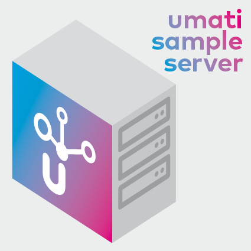

# umati sample server



Sample-Server implementation of various umati endorsed OPC UA companion specifications. Provides a :whale: :package: to run locally for development purpose.

## Build status


[](https://gitpod.io/#https://github.com/umati/Sample-Server)

## Current Implementation

### Scope

This implementation provides simulationed instances for the machine tool and woodworking specification, which changes most values in a pseudo random way. As no real machine simulation is done in the background, the values need not correlate with each other. Also only reading of values of OPC UA-clients is implemented. All write requests are ignored silently.

### Machine Tool Examples

This is an example implementation of the [OPC UA Machine Tool companion specification](https://reference.opcfoundation.org/MachineTool/docs/) based on open62541. The server provides several simulated machine tools, which show different extension stages of the specification.

### Woodworking Examples

This is an example implementation of the [OPC UA for Woodworking companion specification](https://reference.opcfoundation.org/Woodworking/docs/). The server provides two simulated woodworking machines, a basic one implementing only mandatory variables/objects and a full one implementing every optional variable/object.

### Geometrical Measurement Systems Example

This is an example implementation oof the [OPC UA for Geometrical Measuring Systems companion specification](https://www.vdma.org/viewer/-/v2article/render/47597927). The server provide one simulated `BasisGMS` instance.

### Additive Manufacturing Examples

This is an example implementation of the [OPC UA for Additive Manufacturing companion specification](https://reference.opcfoundation.org/AdditiveManufacturing/docs/). The server provides two simulated additive manufacturing machines, a basic one implementing only mandatory variables/objects and a full one implementing every optional variable/object.

## Public available instance

The container image build by this repository is run public at `opc.tcp://opcua.umati.app:4840` (Security: none and higher / Authentication: anonymous) in the `develop` version.

## Container Image

This repository automatically builds a sample server container image to use image for your local development purposes. Pull this public image at: `docker pull ghcr.io/umati/sample-server:main`

To run this image you need a docker installation and than typically:
`docker run -d -p 4840:4840 ghcr.io/umati/sample-server:main`

Refer to the [docker documentation](https://docs.docker.com/) for details.

## Local Usage

To read how to prepare a VM and to test the server locally, please refer to the [usage documentation](doc/Usage.md).
To read how to compile the Sample-Server yourself, refer to the [compilation documentation](doc/Compile.md).

## Configuration

The configuration uses a json format. By default, the server looks for a file `configuration.json`. The supported parameters are:

```json
{
    "Hostname": "localhost", // Hostname of the server, should be identical to the hostname that is used by OPC UA clients to connect to the server.
    "Encryption": { // Optional encryption, can be omitted to only support unencrypted connections
        "ServerCert": "server_cert.der", // Server certificate
        "ServerKey": "server_key.der", // Server private key for the certificate
        "TrustedClients": ["trusted/test.pem"], // List of allowed clients, if empty, all client certificates are accepted
        "IssuerCerts": [], // List of allowed issuers
        "Revocation": [] // List of revoked certificates.
    }
}
```

## Concept

This implementation represents the OPC UA Instance with an instance of an C++ struct and connects them together. So writing an value in the C++ instance will also set this value in the corresponding `OPC UA node`. The binding is established by utilizing reflection (an improved version of the binding in [this publication](https://ieeexplore.ieee.org/document/8972189)).

The binding is done by comparing the name of structure members with the browse name of the OPC UA instance. As the binding uses memory addresses of the C++ instance, the instance itself must not be copied after the binding.

## Folder Structure

```text
├──AdditiveManufacturing   Simulated Additive Manufacturing machine
├──arch                    architecture specific files
├──cmake                   CMake files for building the project, e.g. custom find-scripts
├──Exceptions              Custom exceptions
├──GMS                     Simulated GMS instance
├──MachineTools            Simulated machine tools
├──model                   Unpublished/Fixed NodeSet files
├──OpcUaTypes              C++ equivalent of some OPC UA DataTypes and helpers for their definition
├──Robotics                Simulated Robots
├──tests                   Some unit tests, initially created for tracking down bugs
├──tools/certGen           Custom certificate generator tool           
├──TypeDefinition          Definition of C++ Types for OPC UA Types, that can be bind later
├──UmatiServerLib          Library for binding the defined types to OPC UA instances
├──Woodworkng              Simulated wood working sample machines
```

## License


This sample server implementation is licensed under the [Mozilla Public License v2.0 (MPLv2)](LICENSE) except otherwise stated in the header of a file.
