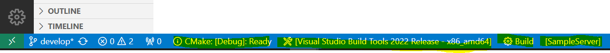
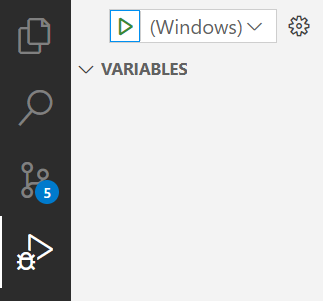

# How to build using vscode
## Prerequisites
* Visual Studio Code
* [Build tools for Visual Studio](https://visualstudio.microsoft.com/de/downloads/#build-tools-for-visual-studio-2022)
* Visual Studio Code *CMake Tools* extension
* Visual Studio Code *C/C++ Extension Pack* extension

## Download and Build
```ps
git clone https://github.com/umati/Sample-Server.git
git submodule update --init --recursive
# Get the .vscode folder
cp -R doc/.vscode .
```

There are two cmake-based build steps using two different `CMakeLists.txt`:
1. `.github/CMakeLists.txt` Builds the dependencies (git submodules) and the Sample-Server. Only required once after pulling the repository or after an update of the dependencies.
2. `./CMakeLists.txt` builds only the Sample-Server not the dependencies. This file is used for building and testing.

For Step 1 run the following commands in powershell:

```ps
# Build folder for dependencies (submodules)
mdkir _build
# Install folder for dependencies
mkdir _install

# Optional but recommended: add "_build/", "build/", and "_install/" to
# your .\git\info\exclude filed, which is similar to .gitignore. You can
# open it by using the command 
notepad .\.git\info\exclude 

# Optional but might fix breaking build on some cmake versions: Remove line "DOWNLOAD_EXTRACT_TIMESTAMP true" from .github\CMakeLists.txt

cd _build
# Replace <...> with your path to the repository
cmake -DCMAKE_INSTALL_PREFIX:PATH="C:\<...>\Sample-Server\_install" ..\.github
cmake --build .
```

For Step 2, i.e., building only the Sample-Server:
* Hit `ctrl+shift+p` and enter `> CMake: Select a Kit` command. Then select *Visual Studio Build Tools 2022 Release - x86_amd64*
* Hit `ctrl+shift+p` and enter `> CMake: Configure` to configure
* Hit `ctrl+shift+p` and enter `> CMake: Build Target` the select `SampleServer EXECUTABLE` to build.

Alternativly you can use the buttons at the bottom of the IDE:


Alternative for Step 2 (using commandline):
```ps
mkdir build
cd build
# Replace <...> with your path to the repository
cmake --no-warn-unused-cli -DCMAKE_INSTALL_PREFIX:STRING="C:/<...>/Sample-Server/_install" -DCMAKE_EXPORT_COMPILE_COMMANDS:BOOL=TRUE -G "Visual Studio 17 2022" -T host=x86 -A x64 ..
cmake --build . -t SampleServer
```

## Running using vscode
Get the sample configuration.json file
```ps
cp .vscode/configuration.json configuration.json
```
Run by hitting the green arrow.



Server should be available on `localhost:34840`

Alternatively run by using powershell:
```ps
# In root directory of repository
.\build\Debug\SampleServer.exe
```