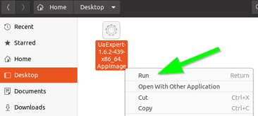
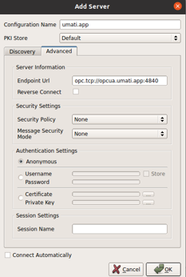
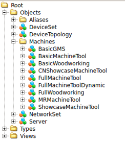

# Sample-Server

## How do I work with the umati Sample-Server

1. Operating System
   - [Ubuntu 20.04 (focal fossa)](https://ubuntu.com/download/desktop) on
   - [VMware Workstation 16 Player](https://www.vmware.com/de/products/workstation-player.html)
2. Sample-Server Environment
   - [Docker Engine on Ubuntu](https://docs.docker.com/engine/install/ubuntu/)
3. Sample-Server package
   - from [GitHub](https://github.com/umati/Sample-Server/pkgs/container/sample-server)
4. OPC UA Client
   - [UaExpert on Linux](https://www.unified-automation.com/de/downloads/opc-ua-clients/uaexpert.html)

## How to install the Sample-Server

### Steps 1+2 OS and Environment

- look at the corresponding installation manuals on the download pages

### Step 3 Install Sample-Server package

- download Sample-Server package
    `docker pull ghcr.io/umati/sample-server:develop`

- run the container
    `docker run -d -p 4840:4840 ghcr.io/umati/sample-server:develop`

- check if container is running
    `docker container ls -a`

### Step 4 Install [UaExpert OPC UA](https://www.unified-automation.com/products/development-tools/uaexpert.html) Client

- open `*.tar` file with archive manager and run the `*.AppImage`
  
  

- add a new server with the correct endpoint
  
  

- connect to the server and browse to the `Machines` folder
  
  
